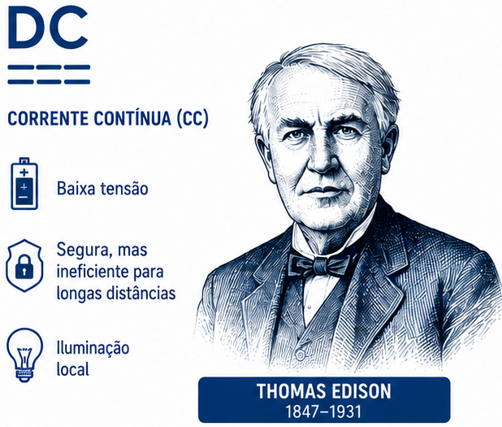
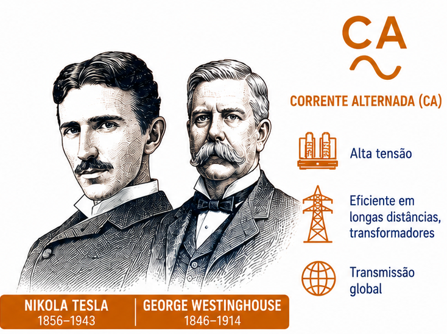

## Sumário

- Eletricidade
- Eletrônica de potência
- Aplicações da eletrônica de potência
- Breve histórico
- Tipos de circuitos de eletrônica de potência
- Características e especificações de chaves
- Dispositivos semicondutores
- Características de controle
- Módulos de potência

---

## A Batalha das Correntes

:::: {.columns}

::: {.column width="50%"}

{width=80%}
:::

::: {.column width="50%"}

{width=100%}
:::

::::

---

## A necessidade de converter energia

:::: {.columns}

::: {.column width="40%"}
{width=100%}
:::

::: {.column width="60%"}
### Rede em CA, cargas em CC

A corrente alternada venceu a transmissão pela eficiência, mas grande parte dos equipamentos — motores CC industriais, tração elétrica, eletrólise — continuava operando em corrente contínua.

Esse descompasso criou a necessidade de **converter CA em CC** em grande escala: nascia a motivação histórica para a eletrônica de potência.
:::

::::
---

## O que é eletrônica de potência?

::: {.callout-note title="Eletrônica de potência"}
 **Conversão e do controle de energia elétrica** por meio de dispositivos semicondutores operando como **chaves**.
:::

- Combina conceitos de **eletrônica**, **circuitos de potência** e **controle**.
- Converte energia elétrica de uma forma para outra (CA↔CC, tensão/frequência), com **alta eficiência**.`

---

## Onde aparece

- Fontes de alimentação chaveadas (computadores, celulares)
- Acionamento de motores (drives CC e CA)
- Sistemas de energia renovável (inversores solares, eólica)
- Transmissão em corrente contínua (HVDC) e FACTS
- Carregadores de veículos elétricos

---

# Breve histórico

---

## Marcos históricos

- **1900s** — Retificadores de arco de mercúrio.
- **1948** — Invenção do transistor (Bell Labs).
- **1956** — Invenção do tiristor (SCR), também na Bell Labs.
- **1958** — General Electric comercializa o primeiro tiristor: nasce a eletrônica de potência moderna.
- Décadas seguintes: MOSFET de potência, IGBT, e mais recentemente dispositivos de **carbeto de silício (SiC)** e **nitreto de gálio (GaN)**.

---

# Tipos de circuitos de eletrônica de potência

---

## Seis categorias principais {.smaller}

::: {.callout-note title="Definição"}
1. **Retificadores a diodo** — CA → CC (não controlado)
2. **Retificadores controlados** — CA → CC (tensão CC controlável)
3. **Conversores CA-CA** (controladores de tensão CA / cicloconversores)
4. **Conversores CC-CC** (choppers)
5. **Conversores CC-CA** (inversores)
6. **Chaves estáticas**
:::

Cada categoria converte energia entre formas CA/CC controlando a **condução das chaves**, não dissipando energia como resistores.

---

# Características de chaves

---

## Chave ideal vs. chave prática

::: {.callout-note title="Definição"}
Uma **chave ideal** teria: queda de tensão nula em condução, corrente de fuga nula em bloqueio, e comutação (liga/desliga) instantânea — logo, **perdas nulas**.
:::

- Chaves reais apresentam:
  - Queda de tensão em condução ($V_{on}$)
  - Corrente de fuga em bloqueio
  - Tempos de comutação finitos ($t_{on}$, $t_{off}$) → **perdas de comutação**
- O projeto de eletrônica de potência busca minimizar essas perdas e o estresse elétrico sobre o dispositivo.

---

# Dispositivos semicondutores de potência

---

## Famílias de dispositivos

- **Diodos de potência** — não controlados
- **Tiristores (SCR)** — controle apenas do disparo (turn-on); desligamento pela própria corrente/circuito
- **BJTs, MOSFETs, IGBTs** — controláveis tanto no disparo quanto no bloqueio
- **GTOs, IGCTs, MCTs** — tiristores com desligamento controlado

---

## Características de controle

::: {.callout-note title="Definição"}
- **Controlados por corrente**: BJT (corrente de base)
- **Controlados por tensão/carga**: MOSFET, IGBT (tensão de porta/gate)
:::

Dispositivos controlados por tensão dominam aplicações modernas por exigirem circuitos de acionamento (*gate drive*) mais simples e de menor perda.

---

# Módulos de potência e módulos inteligentes

---

## Integração de dispositivos

- **Módulos de potência**: várias chaves (ex.: um braço ou uma ponte completa) encapsuladas junto, com isolamento térmico e elétrico otimizado.
- **Módulos inteligentes (IPM)**: módulo de potência + circuito de acionamento (*gate drive*) + proteção (sobrecorrente, sobretemperatura) integrados.

---

## Resumo da aula {.smaller}

- Eletrônica de potência converte e controla energia elétrica usando semicondutores como chaves, com alta eficiência.
- Do retificador de arco de mercúrio ao SCR (1958) e aos dispositivos modernos de SiC/GaN.
- Seis categorias de conversores: retificador a diodo, retificador controlado, CA-CA, CC-CC, CC-CA e chave estática.
- Chave ideal tem perdas nulas; chaves reais têm queda de tensão, fuga e tempos de comutação finitos.
- Diodos (não controlados), tiristores (disparo controlado) e transistores de potência (disparo e bloqueio controlados).
- Módulos integram múltiplas chaves; módulos inteligentes agregam acionamento e proteção.

---

## Referências

- Rashid, M. H. *Power Electronics: Devices, Circuits, and Applications*, 4ª ed. (International Edition), Pearson, 2014 [@rashid2014power] — Cap. 1.
