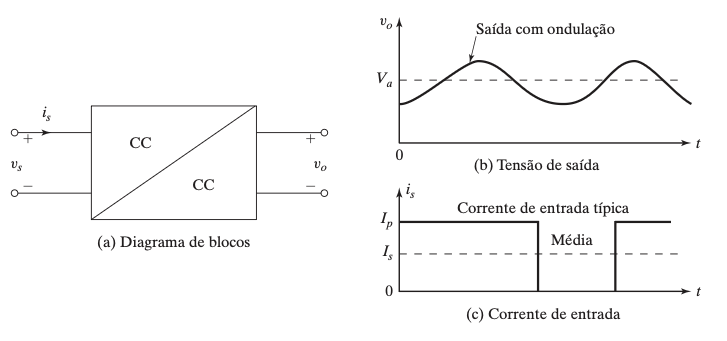

## Sumário {.smaller}

- Introdução aos conversores CC-CC
- Parâmetros de desempenho
- Conversor abaixador de tensão (*buck*) — princípio e carga RL
- Conversor elevador de tensão (*boost*) — princípio e carga resistiva
- Parâmetros de limitação de frequência
- Classificação dos conversores por quadrante
- Reguladores chaveados: buck, boost, buck-boost e Ćuk
- Comparação de reguladores
- Conversor boost com várias saídas
- Conversor boost alimentado por retificador a diodo
- Modelos médios e análise no espaço de estados
- Filtros de entrada/saída e CIs de acionamento

---

## Conversão CC - CC

{width=100%}

---

## O que é um conversor CC-CC?

::: {.callout-note title="Conversor CC-CC"}
Converte diretamente uma tensão CC fixa em uma tensão CC **variável**. É o equivalente CC de um transformador CA com relação de espiras continuamente variável — também chamado de **pulsador** (*chopper*).
:::

- Assim como o transformador, pode **baixar** ou **elevar** a tensão CC de entrada.
- Amplamente utilizado no controle de tração de motores: veículos elétricos, trólebus, guindastes portuários, empilhadeiras, transportadores de mineração.
- Propicia controle suave de aceleração, alta eficiência e resposta dinâmica rápida.
- Permite **frenagem regenerativa** de motores CC, devolvendo energia à fonte.
- Usado em reguladores de tensão CC e, com indutor, para gerar fontes de corrente CC (inversores de fonte de corrente).
- Presente na conversão de energia em sistemas de energia renovável.

---

# Parâmetros de Desempenho

---

## Grandezas de um conversor CC-CC

- Tensões e correntes de entrada e saída de um conversor CC-CC contêm componentes **harmônicas/ondulação**.
- Potência CC de saída: $P_{CC} = I_a V_a$
- Potência CA de saída: $P_{CA} = I_o V_o$
- Eficiência do conversor: $\eta_c = \dfrac{P_{CC}}{P_{CA}}$

Onde:

- $V_a$ e $I_a$ são a tensão e corrente médias de saída (CC).
- $V_o$ e $I_o$ são a tensão e corrente RMS de saída (CA).

---

## Ondulação e fatores de ondulação

- Conteúdo rms de ondulação da tensão de saída: $V_r = \sqrt{V_o^2 - V_a^2}$
- Conteúdo rms de ondulação da corrente de entrada: $I_r = \sqrt{I_i^2 - I_s^2}$
- Fator de ondulação da tensão de saída: $FR_o = \dfrac{V_r}{V_a}$
- Fator de ondulação da corrente de entrada: $FR_s = \dfrac{I_r}{I_s}$

::: {.callout-note title="Frequência de chaveamento"}
A eficiência depende das perdas de chaveamento, que dependem da frequência $f$. Frequências mais altas reduzem o tamanho de capacitores e indutores, mas o projetista precisa equilibrar requisitos conflitantes. Em geral, $f$ é maior do que a frequência de áudio (18 kHz).
:::

---

# Conversor Abaixador de Tensão (*Buck*)

---

## Princípio de operação

- A chave $SW$ (pulsador/*chopper*) pode ser um BJT, MOSFET, GTO ou IGBT de potência.
- Intervalo $t_1$: chave fechada, $V_s$ aplicada à carga.
- Intervalo $t_2$: chave aberta, tensão sobre a carga é zero.

Tensão média de saída:
$$V_a = \frac{1}{T}\int_0^{t_1} v_0\,dt = \frac{t_1}{T}V_s = f t_1 V_s = kV_s$$

onde $k = t_1/T$ é o **ciclo de trabalho** (razão cíclica) e $f$ é a frequência de chaveamento.

- Corrente média de carga: $I_a = V_a/R = kV_s/R$
- Resistência efetiva de entrada vista pela fonte: $R_i = V_s/I_a = R/k$ — o conversor faz a fonte "enxergar" uma resistência variável com $k$.

---

## Controle: PWM vs. frequência variável

1. **Operação em frequência constante (PWM)** — a frequência $f$ (ou período $T$) é mantida constante, e o tempo de chave ligada $t_1$ é variado (*modulação por largura de pulso*).
2. **Modulação em frequência** — a frequência $f$ é variada, mantendo $t_1$ ou $t_2$ constantes. Gera harmônicas em frequências imprevisíveis e dificulta o projeto do filtro.

---

## Geração do ciclo de trabalho

- Comparação de um sinal CC de referência $v_r$ com uma portadora dente de serra $v_{cr}$.
- Ciclo de trabalho resultante: $k = \dfrac{V_r}{V_{cr}} = M$, onde $M$ é o **índice de modulação**.

**Algoritmo:**

1. Gerar uma onda triangular de período $T$ (portadora $v_{cr}$) e um sinal CC de referência $v_r$.
2. Comparar os sinais e gerar um pulso de largura $kT$.
3. Aplicar o pulso ao dispositivo de chaveamento (via circuito isolado).

---

# Conversor Abaixador com Carga RL

---

## Modos de operação

- **Modo 1** ($0 \le t \le t_1 = kT$): chave fechada, corrente flui da fonte para a carga.
- **Modo 2** ($0 \le t \le t_2 = (1-k)T$): chave aberta, corrente de carga continua fluindo através do **diodo de roda livre** $D_m$.
- Aproximação usual: constante de tempo de carga $\tau = L/R \gg T$, corrente varia aproximadamente de forma linear.

---

## Corrente de carga e condição de corrente contínua

- Ondulação pico a pico da corrente: $\Delta I = I_2 - I_1$, máxima em $k = 0{,}5$:
$$\Delta I_{max} = \frac{V_s}{R}\tanh\frac{R}{4fL} \approx \frac{V_s}{4fL} \quad (\text{para } 4fL \gg R)$$
- Em baixa frequência/baixo $k$, a corrente pode se tornar **descontínua**.
- Condição para corrente contínua, com $x = E/V_s$ (razão da fem de carga):
$$x \le \frac{e^{kz}-1}{e^{z}-1}, \qquad z = \frac{TR}{L}$$

---

# Conversor Elevador de Tensão (*Boost*)

---

## Princípio de operação

- Chave fechada por $t_1$: corrente no indutor $L$ cresce, energia é armazenada.
- Chave aberta por $t_2$: energia armazenada é transferida à carga através do diodo $D_1$.
- Ondulação pico a pico da corrente no indutor: $\Delta I = \dfrac{V_s}{L}t_1$
- Tensão média de saída:
$$v_o = V_s\left(1 + \frac{t_1}{t_2}\right) = \frac{V_s}{1-k}$$

::: {.callout-note title="Limite de operação"}
O conversor não pode ficar ligado continuamente ($k=1$): para $k \to 1$ a tensão de saída cresce sem limite e fica muito sensível a variações de $k$.
:::

- Aplicável também à **transferência de energia entre duas fontes de tensão** (ex.: frenagem elétrica de motores CC devolvendo energia a uma fonte fixa $E$), desde que $0 < V_s < E$.

---

# Conversor Elevador com Carga Resistiva

---

## Modos de operação

- **Modo 1**: chave $S_1$ fechada, corrente cresce através de $L$ e da chave.
- **Modo 2**: chave $S_1$ aberta, corrente do indutor flui através da carga $R$ (e do diodo).
- Ondulação da corrente: $\Delta I = I_2 - I_1 = \dfrac{V_s}{R}kT$
- Válido para $E \le V_s$; se $E \ge V_s$ e a chave permanecer aberta, a corrente no indutor se torna descontínua.

---

# Parâmetros de Limitação de Frequência

---

## Fatores que limitam a frequência de chaveamento

*(conteúdo a desenvolver — ver Cap5CC-CC.pdf, seção 5.7: perdas de chaveamento, tempos de comutação dos dispositivos, e o compromisso entre $f$ e o tamanho de filtros)*

---

# Classificação dos Conversores

---

## Conversores por quadrante {.smaller}

::: {.callout-note title="Definição"}
Um conversor de **primeiro quadrante** conduz corrente apenas para a carga (tensão e corrente positivas — atua como retificador). Um diodo em antiparalelo permite fluxo bidirecional (dois quadrantes); a inversão de polaridade da tensão permite operação em quatro quadrantes.
:::

1. **Primeiro quadrante** — $v_o > 0$, $i_o > 0$: funciona como retificador.
2. **Segundo quadrante** — $v_o > 0$, $i_o < 0$: corrente sai da carga; funciona como inversor.
3. **Primeiro e segundo quadrantes** — $v_o > 0$ sempre, $i_o$ positiva ou negativa (combinação dos dois anteriores).
4. **Terceiro e quarto quadrantes** — $v_o < 0$ sempre, $i_o$ positiva ou negativa.
5. **Quatro quadrantes** — $v_o$ e $i_o$ podem ser positivas ou negativas; combina os conversores de 1º/2º e 3º/4º quadrantes. Útil para acionamento de motores CC com reversão de sentido e frenagem.

---

# Reguladores Chaveados

---

## Visão geral

::: {.callout-note title="Regulador chaveado"}
Utiliza um ou mais dispositivos de chaveamento para converter uma tensão CC em outra, com regulação por controle do ciclo de trabalho — princípio idêntico ao dos conversores CC-CC já estudados.
:::

Quatro topologias básicas:

- **Buck** — abaixador de tensão
- **Boost** — elevador de tensão
- **Buck-boost** — abaixador/elevador (inversor de polaridade)
- **Ćuk** — abaixador/elevador com corrente de entrada e saída contínuas

*(conteúdo detalhado a desenvolver para cada topologia — ver Cap5CC-CC.pdf, seções 5.9.1 a 5.9.4: circuitos, formas de onda e equações de projeto)*

---

## Reguladores buck (5.9.1)

*(a desenvolver)*

---

## Reguladores boost (5.9.2)

*(a desenvolver)*

---

## Reguladores buck-boost (5.9.3)

*(a desenvolver)*

---

## Reguladores Ćuk (5.9.4)

*(a desenvolver)*

---

## Limitações da conversão em um único estágio (5.9.5)

*(a desenvolver)*

---

# Comparação de Reguladores

---

## Buck × boost × buck-boost × Ćuk

*(conteúdo a desenvolver — ver Cap5CC-CC.pdf, seção 5.10: vantagens, desvantagens e critérios de escolha entre topologias)*

---

# Conversor Boost com Várias Saídas

---

## Múltiplas saídas com controle de multiplexação no tempo

*(conteúdo a desenvolver — ver Cap5CC-CC.pdf, seção 5.11)*

---

# Conversor Boost Alimentado por Retificador a Diodo

---

## Correção de fator de potência

*(conteúdo a desenvolver — ver Cap5CC-CC.pdf, seção 5.12: obtenção de corrente de entrada senoidal e em fase com a tensão CA)*

---

# Modelos Médios de Conversores

---

## Modelagem por valores médios

*(conteúdo a desenvolver — ver Cap5CC-CC.pdf, seção 5.13)*

---

# Análise de Reguladores no Espaço de Estados

---

## Técnica de cálculo da média no espaço de estados

*(conteúdo a desenvolver — ver Cap5CC-CC.pdf, seção 5.14)*

---

# Filtros de Entrada e Saída para Conversores

---

## Considerações de projeto

*(conteúdo a desenvolver — ver Cap5CC-CC.pdf, seção 5.15)*

---

# CI de Acionamento para Conversores

---

## Circuitos integrados de controle PWM

*(conteúdo a desenvolver — ver Cap5CC-CC.pdf, seção 5.16)*

---

## Resumo da aula {.smaller}

- Conversor CC-CC (pulsador/*chopper*) converte uma tensão CC fixa em uma tensão CC variável, controlando o ciclo de trabalho $k$.
- Conversor abaixador (buck): $V_a = kV_s$; conversor elevador (boost): $v_o = V_s/(1-k)$.
- Com carga RL, o diodo de roda livre mantém a continuidade da corrente; a ondulação máxima ocorre em $k = 0{,}5$.
- Conversores podem operar em 1, 2 ou 4 quadrantes, conforme a polaridade de tensão/corrente admitida.
- Reguladores chaveados (buck, boost, buck-boost, Ćuk) aplicam os mesmos princípios a fontes de alimentação reguladas.
- Tópicos avançados: conversor boost com várias saídas, correção de fator de potência, modelos médios e análise no espaço de estados, projeto de filtros e CIs de controle PWM.

---

## Referências

- Rashid, M. H. *Power Electronics: Devices, Circuits, and Applications*, 4ª ed. (International Edition), Pearson, 2014 [@rashid2014power] — Cap. 5.
