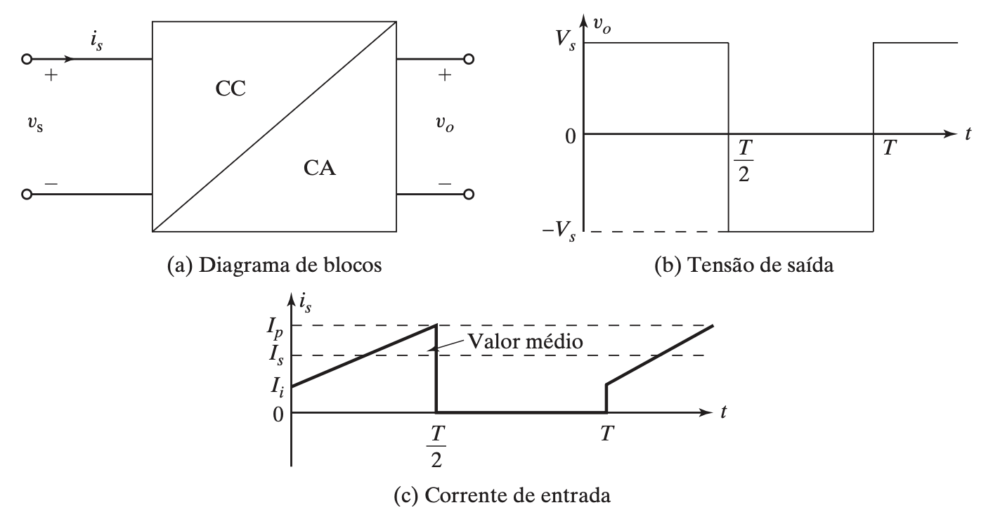
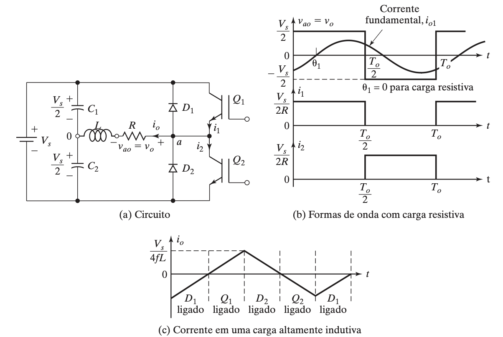

## Sumário {.smaller}

- Introdução aos inversores (conversores CC-CA)
- Parâmetros de desempenho (DHT, FD, FH, LOH)
- Princípio de operação — inversor monofásico em meia ponte
- Inversores monofásicos em ponte completa
- Inversores trifásicos — condução por 180° e por 120°
- Controle de tensão de inversores monofásicos (PWM múltiplo, senoidal, deslocamento de fase)
- Controle de tensão de inversores trifásicos (PWM senoidal, 60°, terceira harmônica, vetores espaciais)
- Redução de harmônicas
- Inversores de corrente (CSI)
- Inversor com barramento CC variável
- Inversor elevador (*boost*)
- Projeto de inversores

---

## Inversor de Frequência

::: {.callout-note title="Inversor: conversor CC-CA"}
Converte uma tensão CC de entrada em uma tensão CA de saída **simétrica**, com amplitude e frequência desejadas.
:::

- A tensão de saída pode ser fixa ou variável, em frequência fixa ou variável.
- Na prática, a forma de onda não é senoidal e contém harmônicas — técnicas de chaveamento (PWM) reduzem esse conteúdo harmônico.
- Aplicações: acionadores de motor CA em velocidade variável, energia renovável, transportes, aquecimento por indução, fontes de alimentação ininterrupta (UPS).

---

## Classificação de Inversores
  - **Monofásicos** ou **trifásicos**.
  - **Inversor alimentado por tensão (VFI/VSI)** — tensão de entrada constante.
  - **Inversor alimentado por corrente (CFI/CSI)** — corrente de entrada constante.
  - **Inversor com interligação CC variável** — tensão de entrada controlável.
  - **Inversor de pulso ressonante** — tensão/corrente de saída forçadas a passar por zero via circuito ressonante LC.

---

## Relação de entrada e saída

{width=60%}

---

## Qualidade da tensão/corrente de saída

- Potência de saída: $P_{CA} = I_o V_o \cos\theta = I_o^2 R$
- Potência de entrada: $P_s = I_s V_s$

Onde: 

- $I_o$: Corrente RMS de saída;
- $V_o$: Tensão RMS de saída;
- $I_s$: Corrente RMS de entrada;
- $V_s$: Tensão RMS de entrada;
- $\theta$: Ângulo da impedância da carga;
- $R$: Resistência da carga.

---

## Qualidade da tensão/corrente de saída

- Ondulação rms da corrente de entrada: $I_r = \sqrt{I_i^2 - I_s^2}$, fator de ondulação $FR_s = I_r/I_s$

Onde: $I_i$ e  $I_s$ são os valores rms da corrente de entrada e da corrente de alimentação, respectivamente.

---

## Qualidade da tensão/corrente de saída

::: {.callout-note title="Definição"}
- **Fator harmônico** ($FH_n$): $FH_n = V_{on}/V_{o1}$ — contribuição individual da $n$-ésima harmônica.
- **Distorção harmônica total** (DHT): $DHT = \dfrac{1}{V_{o1}}\sqrt{\sum_{n=2,3,\dots} V_{on}^2}$
- **Fator de distorção** (FD): $FD = \dfrac{1}{V_{o1}}\sqrt{\sum_{n=2,3,\dots}\left(\dfrac{V_{on}}{n^2}\right)^2}$ — mede a distorção residual após um filtro de segunda ordem.
- **Harmônica de mais baixa ordem** (LOH): componente com amplitude $\ge 3\%$ da fundamental e frequência mais próxima da fundamental.
:::

---

## Inversor monofásico em meia ponte

{width=100%}

---

## Inversor monofásico em meia ponte

- Dois pulsadores (*choppers*): quando $Q_1$ conduz por $T_0/2$, $v_o = V_s/2$; quando $Q_2$ conduz, $v_o = -V_s/2$.
- $Q_1$ e $Q_2$ nunca devem conduzir simultaneamente — necessita fonte CC de três fios.
- Tensão rms de saída: $V_o = V_s/2$
- Componente rms fundamental (série de Fourier): $V_{o1} = \dfrac{2V_s}{\sqrt{2}\pi} = 0{,}45\,V_s$

::: {.callout-note title="Diodos de realimentação"}
Para carga indutiva, a corrente não muda instantaneamente com a tensão. Os diodos $D_1$ e $D_2$ conduzem para devolver a energia armazenada na carga à fonte CC — daí o nome *diodos de realimentação*.
:::

- Corrente de alimentação CC (regime senoidal, carga indutiva): $I_s = \dfrac{V_{o1}}{V_s}I_o\cos\theta_1$
- Sequência de acionamento: onda quadrada em $f_o$ com $k=50\%$ para $Q_1$; sinal complementar para $Q_2$.

---

# Inversores Monofásicos em Ponte

---

## Inversor em ponte completa (VSI)

- Quatro pulsadores: $Q_1,Q_2$ ligados simultaneamente → $v_o = V_s$; $Q_3,Q_4$ ligados → $v_o = -V_s$.
- Tensão rms de saída: $V_o = V_s$
- Componente rms fundamental: $V_{o1} = \dfrac{4V_s}{\sqrt{2}\pi} = 0{,}90\,V_s$ (dobro do inversor em meia ponte).
- Potência de saída e tensão de bloqueio reverso das chaves são quatro vezes maiores que no inversor em meia ponte.

::: {.callout-note title="Harmônica de 2ª ordem na alimentação"}
A corrente de alimentação CC contém uma harmônica de segunda ordem que é injetada de volta à fonte — exige um capacitor de barramento CC grande para manter a tensão quase constante, especialmente em média/alta potência.
:::

- Sequência de acionamento: dois pares de sinais complementares ($v_{g1}/v_{g2}$ e $v_{g3}/v_{g4}$), com $Q_3,Q_4$ defasados de $Q_1,Q_2$.

---

# Inversores Trifásicos

---

## Configuração a partir de inversores monofásicos

- Três inversores monofásicos (meia ponte ou ponte completa) conectados em paralelo, com sinais de acionamento defasados de 120° entre si.
- Transformadores com primários isolados e secundários em **delta**, para eliminar harmônicas múltiplas de três ($n=3,6,9,\dots$).
- Alternativa mais compacta: **inversor trifásico em ponte** com seis transistores e seis diodos — dois tipos de controle: condução por **180°** (preferido, melhor uso das chaves) ou por **120°**.

---

## Condução por 180°

- Cada transistor conduz por 180°; a cada instante, três transistores conduzem — seis modos de operação por ciclo (60° cada).
- Chaves da mesma perna nunca são ligadas/desligadas simultaneamente (evita curto-circuito ou tensão indefinida).
- Para carga resistiva conectada em Y, as tensões de fase variam entre $\pm V_s/3$ e $\pm 2V_s/3$ conforme o modo.
- Tensão de linha instantânea (série de Fourier), com harmônicas múltiplas de três ausentes:
$$v_{ab} = \sum_{n=1,3,5,\dots} \frac{4V_s}{n\pi}\operatorname{sen}\!\left(\frac{n\pi}{2}\right)\operatorname{sen}\!\left(\frac{n\pi}{3}\right)\operatorname{sen}\!\left[n\left(\omega t + \frac{\pi}{6}\right)\right]$$
- Tensão rms de linha: $V_L = \sqrt{2/3}\,V_s = 0{,}8165\,V_s$; fundamental: $V_{L1} = 0{,}7797\,V_s$
- Tensão rms de fase: $V_p = V_L/\sqrt{3} = 0{,}4714\,V_s$

---

## Condução por 120°

- Cada transistor conduz por 120° (apenas dois conduzem em qualquer instante) — três modos por semiciclo.
- Modo 1 ($0 \le \omega t \le \pi/3$): $v_{an}=V_s/2$, $v_{bn}=-V_s/2$, $v_{cn}=0$
- Modo 2 ($\pi/3 \le \omega t \le 2\pi/3$): $v_{an}=V_s/2$, $v_{bn}=0$, $v_{cn}=-V_s/2$
- Modo 3 ($2\pi/3 \le \omega t \le \pi$): $v_{an}=0$, $v_{bn}=V_s/2$, $v_{cn}=-V_s/2$
- Existe sempre um intervalo com uma fase em aberto — menos aproveitamento das chaves que a condução por 180°.

---

# Controle de Tensão de Inversores Monofásicos

---

## Técnicas de PWM monofásico

- **Modulação por largura de pulsos múltiplos** — vários pulsos por semiciclo, mesma largura.
- **PWM senoidal (SPWM)** — largura dos pulsos varia senoidalmente, aproximando a tensão de saída de uma senoide e empurrando harmônicas para frequências mais altas.
- **PWM senoidal modificada** — SPWM aplicado apenas próximo aos picos da referência, reduzindo o número de chaveamentos.
- **Controle por deslocamento de fase** — a tensão de saída é controlada pela defasagem entre os sinais de acionamento de duas pontes (ou dois braços).

*(conteúdo detalhado a desenvolver — ver Cap6Inversores.pdf, seções 6.6.1 a 6.6.4: índice de modulação, geração dos sinais de referência/portadora e efeito sobre o espectro harmônico)*

---

# Controle de Tensão de Inversores Trifásicos

---

## Técnicas de PWM trifásico

- **PWM senoidal** — cada braço comparado a uma referência senoidal defasada de 120°.
- **PWM 60°** — referência achatada nos 60° centrais de cada semiciclo.
- **PWM de terceira harmônica** — injeção de terceira harmônica na referência para aumentar a tensão fundamental de saída sem sobremodulação.
- **Modulação por vetores espaciais (SVM)** — representa os estados das chaves como vetores espaciais; a tensão de referência é sintetizada pela combinação de vetores ativos e vetores nulos.

*(conteúdo detalhado a desenvolver — ver Cap6Inversores.pdf, seção 6.7: transformação de vetor espacial, sequência de chaveamento SVM e comparação entre técnicas de PWM)*

---

# Redução de Harmônicas

---

## Técnicas de eliminação de harmônicas

*(conteúdo a desenvolver — ver Cap6Inversores.pdf, seção 6.8: entalhes (*notches*) na forma de onda para eliminar harmônicas de baixa ordem)*

---

# Inversores de Corrente (CSI)

---

## Inversor alimentado por corrente

*(conteúdo a desenvolver — ver Cap6Inversores.pdf, seção 6.9: princípio de operação, vantagens/desvantagens frente ao VSI)*

---

# Inversor com Barramento CC Variável

---

## Controle pela tensão de entrada

*(conteúdo a desenvolver — ver Cap6Inversores.pdf, seção 6.10)*

---

# Inversor Elevador (*Boost*)

---

## Princípio do inversor boost

*(conteúdo a desenvolver — ver Cap6Inversores.pdf, seção 6.11: ganho de tensão CC e CA, métodos de controle)*

---

# Projeto de Inversores

---

## Considerações de projeto

*(conteúdo a desenvolver — ver Cap6Inversores.pdf, seção 6.12: filtros de saída, dimensionamento de chaves e diodos)*

---

## Resumo da aula {.smaller}

- Inversor converte uma tensão/corrente CC em uma tensão/corrente CA de amplitude e frequência controláveis.
- Qualidade da saída é avaliada por DHT, FD, FH e LOH.
- Inversor monofásico: meia ponte ($V_{o1}=0{,}45V_s$) e ponte completa ($V_{o1}=0{,}90V_s$); diodos de realimentação devolvem energia da carga indutiva à fonte.
- Inversor trifásico em ponte opera por condução de 180° (preferida) ou 120°; harmônicas múltiplas de três são eliminadas na tensão de linha.
- Controle de tensão via PWM (múltiplo, senoidal, terceira harmônica, deslocamento de fase, SVM) reduz harmônicas e permite controlar a amplitude da fundamental.
- Tópicos avançados: redução de harmônicas por entalhes, inversores de corrente (CSI), barramento CC variável, inversor boost e projeto de filtros/chaves.

---

## Referências

- Rashid, M. H. *Power Electronics: Devices, Circuits, and Applications*, 4ª ed. (International Edition), Pearson, 2014 [@rashid2014power] — Cap. 6.
